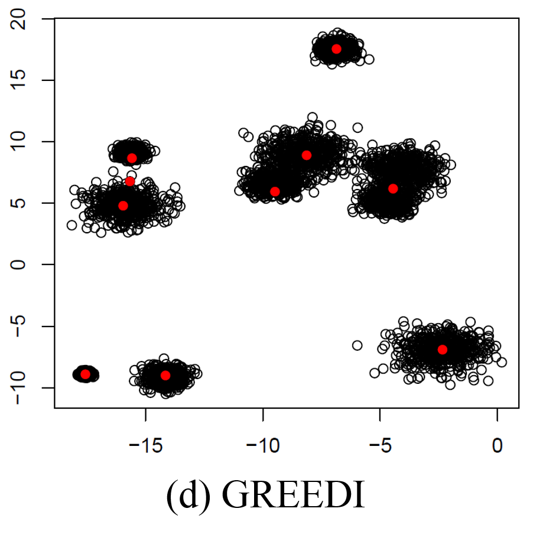
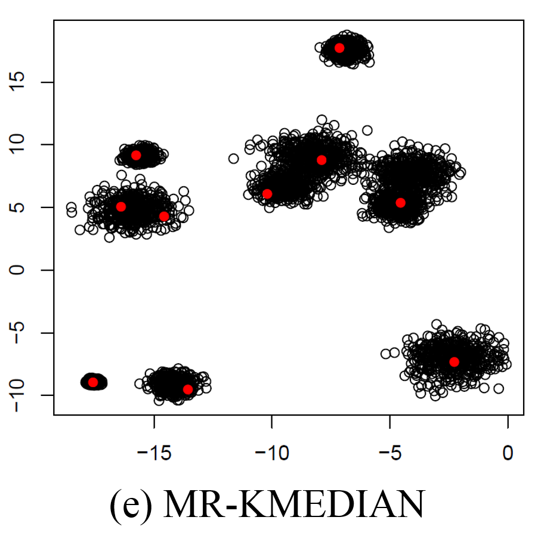

#PAMAE: PArallel k-Medoids clustering with high Accuracy and Efficiency
##1. Overview
The k-medoids algorithm is one of the best-known clustering algorithms. Despite this, however, it is not as widely used for big data analytics as the k-means algorithm, mainly because of its high computational complexity. Many studies have attempted to solve the efficiency problem of the k-medoids algorithm, but all such studies have improved efficiency at the expense of accuracy. In this paper, we propose a novel parallel k-medoids algorithm, which we call PAMAE, that achieves both high accuracy and high efficiency. We identify two factors—“global search” and “entire data”—that are essential to achieving high accuracy, but are also very timeconsuming if considered simultaneously. Thus, our key idea is to apply them individually through two phases: parallel seeding and parallel refinement, neither of which is costly. The first phase performs global search over sampled data, and the second phase performs local search over entire data. Our theoretical analysis proves that this serial execution of the two phases leads to an accurate solution that would be achieved by global search over entire data. In order to validate the merit of our approach, we implement PAMAE on Spark as well as Hadoop and conduct extensive experiments using various real-world data sets on 12 Microsoft Azure machines (48 cores). The results show that PAMAE significantly outperforms most of recent parallel algorithms and, at the same time, produces a clustering quality as comparable as the previous most-accurate algorithm. Thu source code and data are available at https://github.com/jaegil/k-Medoid.

##2. Algorithms
- PAM-MR [1]
- FAMES-MR [2]
- CLARA-MR' and CLARA-MR' [3]
- GREEDI [4]
- MR-KMEDIAN [5]
- **PAMAE-Hadoop** : Hadoop implementation of our algorithm
- **PAMAE-Spark** : Spark implementation of our algorithm

>_Reference_ 
[1] Xianfeng Yang and Liming Lian. 2014. A New Data Mining Algorithm Based on MapReduce and Hadoop. Int’l J. of Signal Processing, Image Processing, and Pattern Recognition 7, 2 (2014), 131–142. 
[2] Ying-ting Zhu, Fu-zhang Wang, Xing-hua Shan, and Xiao-yan Lv. 2014. KMedoids Clustering Based on MapReduce and Optimal Search of Medoids. In Proc. 9th Int’l Conf. on Computer Science and Education. 573–577. 
[3] Pelle Jakovits and Satish Narayana Srirama. 2013. Clustering on the Cloud: Reducing CLARA To MapReduce. In Proc. 2nd Nordic Sympo. on Cloud Computing and Internet Technologies. 64–71. 
[4] Baharan Mirzasoleiman, Amin Karbasi, Rik Sarkar, and Andreas Krause. 2013. Distributed Submodular Maximization: Identifying Representative Elements in Massive Data. In Proc. 27th Annual Conf. on Neural Information Processing Systems. 2049–2057. 
[5] Alina Ene, Sungjin Im, and Benjamin Moseley. 2011. Fast Clustering using MapReduce. In Proc. 17th ACM SIGKDD Int’l Conf. on Knowledge Discovery and Data Mining. 681–689.

##3. Data Sets
| Name         | # Object       | # Dim    | Size    | Type  |  Link   |
| :----------- | :------------: | :------: |:-------:|:-----:|:-------:|
| Covertype    | 581,102        | 55       | 71 MB   | int   | [link](https://dmlabdata.blob.core.windows.net/kmedoid/Covertype.csv)|
| Census1990   | 2,458,285      | 68       | 324 MB  | int   | [link](https://dmlabdata.blob.core.windows.net/kmedoid/Census1990.csv)|
| Cosmo50      | 315,086,245    | 3        | 13.6 GB | float | [link](https://dmlabdata.blob.core.windows.net/kmedoid/Cosmo50.csv)|
| TeraClickLog | 4,373,472,329  | 13       | 300 GB  | float | [link 1](https://dmlabdata.blob.core.windows.net/kmedoid/TeraClickLog_1.csv),[2](https://dmlabdata.blob.core.windows.net/kmedoid/TeraClickLog_2.csv),[3](https://dmlabdata.blob.core.windows.net/kmedoid/TeraClickLog_3.csv)|

##4. Configuration
 - We conducted experiments on 12 Microsoft Azure D12v2 instances loacted in Japan. 
 - Each instance has four cores, 28GB of main memory, and 200GB of disk(SSD). 
 - All instances run on Ubuntu 14.04. We used Hadoop 2.7.1 and Spark 1.6.1 for distributed parallel processing. 
 - Ten out of 12 instances were used as worker nodes, and the remaining two instances were used as master nodes. 
 - All the algorithms were written in the Java programming language and run on JDK 1.7.0_101.

##5. How to run
- Compilation
 - To compile the algorithms, the spark-assembly library is needed. It can be downloaded from [Apache Spark]. 
[Apache Spark]: http://spark.apache.org/downloads.html
 - Make _jar file_ using IDE tools. For example, you can easily make it using Eclipse through **_project name->export->jar file_**. It is possible that you just download the jar files from example folder.
- Creating _Azure HDInsight_ instances
 - see [HDInsight Document]
 [HDInsight Document]: https://docs.microsoft.com/en-us/azure/hdinsight/
- Moving the data sets into _HDFS_ folder.
 - Download all datasets from above links and move it to the _Azure master node_.
 - Transfer your dataset from _Azure master node_ into _HDFS_. 
   **``hadoop dfs -put [your master node path] [hdfs path]``**
- Running algirithm using command
 - PAM-MR 
  **``hadoop jar [jar file] [main class] [hdfs input path] [hdfs output path] [# of medoids]``**
 - FAMES-MR 
  **``hadoop jar [jar file] [main class] [hdfs input path] [hdfs output path] [# of medoids]``**
 - CLARA-MR' (type : 0), CLARA-MR (type : 1) 
  **``hadoop jar [jar file] [main class] [hdfs input path] [hdfs output path] [# of samples] [# of medoids] [type]``**
 - GREEDI 
  **``hadoop jar [jar file] [main class] [hdfs input path] [hdfs output path] [# of partitions] [# of medoids]``**
 - MR-KMEDIAN 
  Iteraive Sampling 
    **``hadoop jar [jar file] [main class] [hdfs input path] [hdfs output path] [# of medoids] [upsilon] [# of cores] [# of objects]``** 
   Weighted K-Median  
    **``hadoop jar [jar file] [main class] [hdfs input path] [hdfs sample path] [hdfs output path] [# of medoids] [# of cores]``**
 - PAMAE-Hadoop 
  **``hadoop jar [jar file] [main class] [hdfs input path] [hdfs output path] [# of sampled objects] [# of samples] [# of medoids] [# of partition]``**
 - PAMAE-Spark 
  **``spark-submit --class [main class] [jar file] wasb://[hdfs address] [# of medoids] [# of sampled objects] [# of samples] [# of partitions]``**
  
##6. Example
 - The [example_dataset.csv](example/example_dataset.csv) file is used to visualize the difference of six algorithms. The dataset consist of 10 clusters having 2D 10,000 objects. 
 - **The clustering results are shown in below figures.**  
    
    
 Here, we can easily observe that other approaches suffer from local optima or insufficient size of sample problem. Only our algorithm success to find exact medoids of 10 clusters.

##7. Experiment
The shell(.sh) scripts for our experiments are included in [scripts](scripts).
 - Accuracy and efficiency experiment
  - This experiment is accuracy/efficiency comparisons of eight parallel algorithms.
  - Run all algorithms on the four real datasets when k is set to be 10,25, and 50.
  - The results are [Figure 5](figures/figure_5.pdf) and [Figure 8](figures/figure_8.pdf) in paper.
 - Convergence experiment (Figure 7)
  - This experiment is to verify the convergence of Phase II.
  - Three different seeding strategies are used. 
    (40+2k,5) by CLARA-MR'; (100+5K) by CLARA-MR; and (40K,5) by Phase I of PAMAE.
  - The number of iterations for Phase II is forced to increase from 1 to 10 when k is 50.
  - The results are [Figure 7](figures/figure_7.pdf) in paper.
 - Scalability experiment (Figure 9)
  - ddd
 - Sampling error experiment (Figure 6)
  - ddd
 

